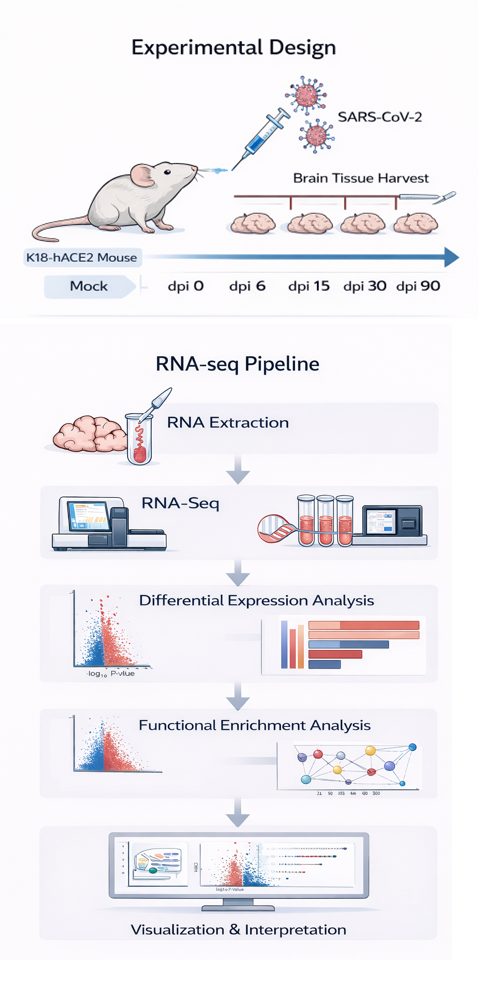

# Long-COVID

Long COVID refers to the persistence of neurological and cognitive symptoms after SARS-CoV-2 infection.  

To investigate transcriptional changes underlying these long-term effects, RNA-seq analysis was performed on brain tissues from a SARS-CoV-2 mouse model.
<p align="center">
  
</p>

---

## RNA-seq Analysis Overview

### NGS Pipeline 
This repository includes a Snakemake-based RNA-seq preprocessing pipeline that performs quality control, optional trimming, genome alignment, and gene-level quantification.  
Pipeline behavior is configured through `config/samples.tsv` and `config/config.yaml`.

#### Samples (config/samples.tsv)
Only three columns are required:
```tsv
sample	fq1	fq2
0-1	0-1_1.fq.gz	0-1_2.fq.gz
0-2	0-2_1.fq.gz	0-2_2.fq.gz
```
#### Configuration: tool selection (config/config.yaml)
Tool selection can be changed without modifying the workflow code:
```text
trimmer: "none"             # none | trim_galore | trimmomatic
aligner: "hisat2"           # hisat2 | star
quantifier: "featurecounts" # featurecounts | htseq
```

#### Execution

```bash
snakemake --use-conda -j 32
```
