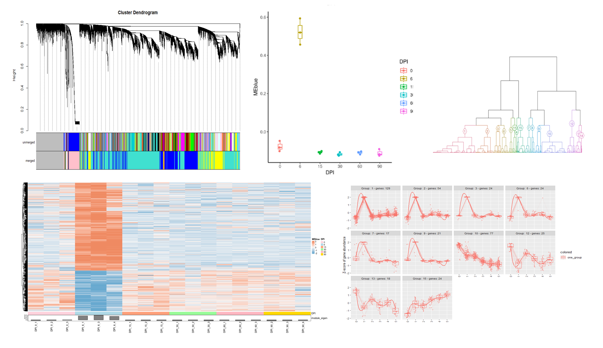
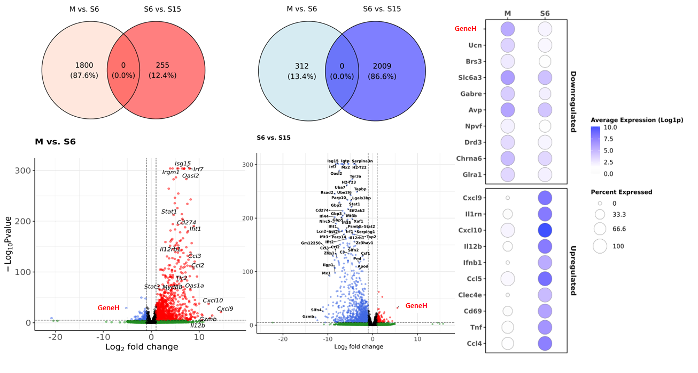
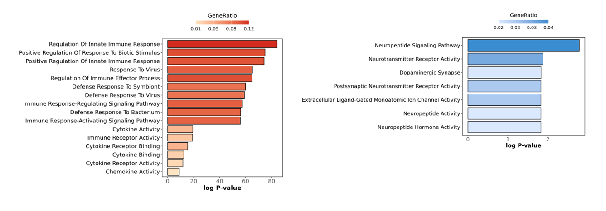
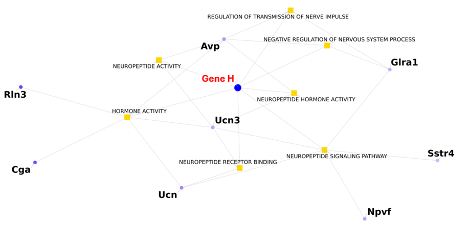

# Long-COVID

Long COVID refers to the persistence of neurological and cognitive symptoms after SARS-CoV-2 infection.  

To investigate transcriptional changes underlying these long-term effects, RNA-seq analysis was performed on brain tissues from a SARS-CoV-2 mouse model.
<p align="center">
  
</p>

---

## Background

### Long COVID

- Long COVID is frequently accompanied by persistent neurological symptoms, including cognitive impairment, fatigue, and sleep disturbances, suggesting long-lasting disruption of neural circuits after SARS-CoV-2 infection.
- Although neuroinflammation and viral neuroinvasion have been implicated, these mechanisms do not fully explain the specificity and persistence of neurological sequelae.
- Given the central role of hypothalamic neuropeptide signaling in regulating arousal, neuronal survival, and homeostasis, we hypothesized that SARS-CoV-2 selectively disrupts this regulatory system, leading to sustained cortical neuronal dysfunction.
- To characterize SARS-CoV-2–induced neurological alterations, whole-brain samples from infected mouse models were collected across multiple time points (DPI 0, 6, 15, 30, 60, and 90). Bulk RNA-seq was used to profile time-dependent transcriptional changes, with particular emphasis on early responses at DPI 6.

---

## RNA-seq Analysis Overview

### NGS Pipeline 
This repository includes a Snakemake-based RNA-seq preprocessing pipeline that performs quality control, optional trimming, genome alignment, and gene-level quantification.  
Pipeline behavior is configured through `config/samples.tsv` and `config/config.yaml`.

#### Samples Definition (config/samples.tsv)
Only three columns are required:
```tsv
Sample      fq1                fq2
sampleA     sampleA_1.fq.gz    sampleA_2.fq.gz
sampleB     sampleB_1.fq.gz    sampleB_2.fq.gz
```
#### Configuration: tool selection (config/config.yaml)
Tool selection can be changed without modifying the workflow code:
```text
trimmer: "none"             # none | trim_galore | trimmomatic
aligner: "hisat2"           # hisat2 | star
quantifier: "featurecounts" # featurecounts | htseq
```

#### Execution

```bash
snakemake --use-conda -j 32
```

## Results


### Gene Pattern Analysis

To identify candidate genes associated with temporal transcriptional changes after SARS-CoV-2 infection, we performed a gene pattern analysis integrating WGCNA and DESeq2.

<p align="left">
  
</p>

- WGCNA was used to cluster genes into co-expression modules based on their expression dynamics across multiple DPI time points.
- We specifically focused on modules showing pronounced expression changes at DPI 6, representing early transcriptional responses to infection.
- In parallel, differential expression analysis using DESeq2 identified genes that were significantly altered at DPI 6 relative to mock controls.
- By intersecting DPI 6–associated co-expression modules with differentially expressed genes, we identified key candidate genes within **hypothalamic neuropeptide signaling pathways** that exhibited coherent early expression changes and potential relevance to long-term neural regulation.
  
---


### DEGs Analysis
<p align="left">
  
</p>

- Differential expression analysis revealed that DPI 6 represents the most pronounced transcriptional shift following SARS-CoV-2 infection, clearly separating from mock and later time points. 
- At this stage, genes involved in innate immune and antiviral responses were strongly upregulated, consistent with peak viral burden and transient neuroinflammatory activation in the brain.
- In contrast, genes associated with neuronal signaling were markedly downregulated at DPI 6, indicating impairment of synaptic and neuromodulatory functions.
- Notably, GeneH, a gene associated with hypothalamic neuropeptide signaling, exhibited one of the most pronounced expression changes among downregulated neuronal genes at DPI 6.
- While immune-related transcriptional programs largely resolved by DPI 15, GeneH and related neuronal signaling genes showed delayed or incomplete recovery, suggesting sustained disruption of neural homeostatic regulation beyond the acute phase of infection.

---

### Go Analysis
<p align="left">
  
</p>

- Gene Ontology (GO) enrichment analysis was performed on differentially expressed genes identified at DPI 6 to characterize the biological processes underlying early transcriptional changes following SARS-CoV-2 infection. 
- Upregulated genes were predominantly enriched for immune-related terms, including regulation of innate immune response, response to virus, and immune signaling pathways, reflecting robust activation of antiviral and inflammatory programs.
- In contrast, downregulated genes were significantly enriched for neuronal and neuromodulatory functions, such as neuropeptide signaling pathways, neurotransmitter receptor activity, and synaptic signaling.
- Notably, terms related to hypothalamic neuropeptide activity were among the most significantly enriched categories within the downregulated gene set.

---

### Gene Network
<p align="left">
  
</p>

- This network visualization illustrates the functional relationships between genes and Gene Ontology (GO) terms associated with hypothalamic neuropeptide signaling. 
- Nodes represent genes (circles) and enriched GO terms (squares), with edges indicating functional associations. 
- Within this network, GeneH emerges as a central node, connecting multiple neuropeptide- and hormone-related GO terms, including neuropeptide signaling pathway, neuropeptide hormone activity, and regulation of nervous system processes. 
- GeneH also shows close connectivity with other neuropeptide-associated genes, suggesting coordinated regulation within a hypothalamic neuropeptide module. 
- This network structure highlights GeneH as a key regulatory component linking transcriptional changes to disrupted neuropeptide-mediated homeostatic control.

---

## Conclusion
- This study identified DPI 6 as a critical time point marked by pronounced transcriptional changes following SARS-CoV-2 infection. 
- While immune-related gene expression was transient and largely resolved after the acute phase, neuronal signaling pathways—particularly hypothalamic neuropeptide regulation—remained persistently disrupted. 
- GeneH emerged as a key candidate gene within this regulatory axis, showing strong network connectivity and delayed recovery. 
- These findings provide a mechanistic link between acute SARS-CoV-2 infection and long-term neurological dysfunction associated with Long COVID.
